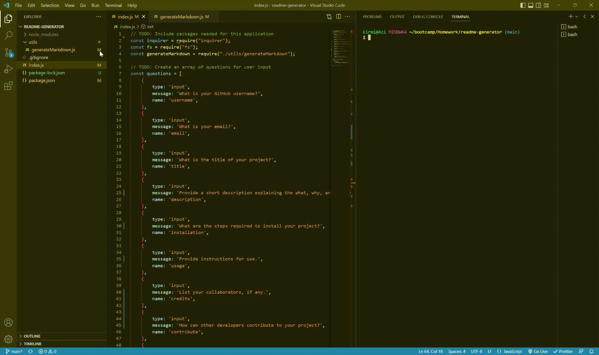

# readme-generator

  ## Description
  
  By answering a few questions, you can create a professional README.
  
  ## Table of Contents
  
  * [Installation](#installation)
  * [Usage](#usage)
  * [Credits](#credits)
  * [License](#license)
  * [Questions](#questions)
  
  ## Installation
  
  none
  
  ## Usage
  
  Call the index.js through the terminal and answer the questions provided.
  https://azimezn.github.io/readme-generator/
  
  
  ## Credits
  
  - Rutgers University Coding Bootcamp
  - GitHub
  
  ## License
  
  N/A

  ## Questions

  You can look at my GitHub profile (https://github.com/azimezn) or email me at azimeznail@gmail.com.